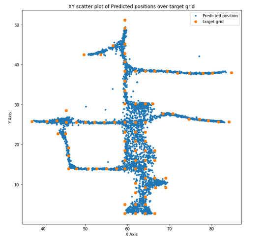
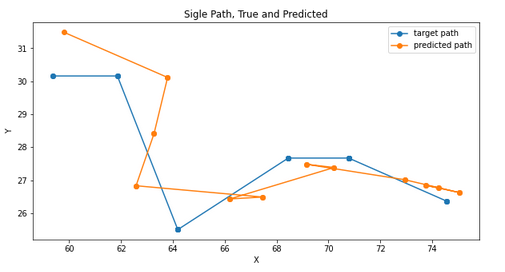

   

For outdoor location, GPS or similar systems most of the time works relative well.  
For indoor location cases, where GPS is not available, surrounding WiFis can pinpoint our location.  
WiFis are present most of the times and detecting them (finding name and signal strength) is free.
With no extra cost for equipment and no new infrastructure needed, we can create a system to accurately find our location.

  

#### Project steps  
To build a system, able to find user's location in a building there are some steps that need to be followed:  
1. A "Wifi Mapping" of the area. A training data set creation from WiFi recordings during walking paths on a building's floor.  
2. A trained model based on data above.  
3. An inference application using trained model above and live WiFi scans.  

  

Both 1 and 3 steps are usually performed with an android or IOS custom application. Mobile applications are suitable for this task due to both efficiency and easy of use for final user. These applications are not in the scope of this git repo.  

  

#### Dataset  
Recorded data consists of WiFi and mobile phone sensor data. Sensor data can be used to further improve model accuracy but are not necessary.  
Our dataset comes from one single floor of one building in a UK University. It consists of 254 paths with an average of 34 checkpoints per path. Our checkpoint grid is very dense, around 2.5 meters. Data collected with a custom android application. Android version used is 10 or 11 which allowed a special option for more frequent WiFi scans (every 6 seconds) whether older versions allowed only 4 scans every 2 minutes. Also note that all paths are located outside rooms, in halls and hallways.  

|DATA TYPE | description |
| :- | :- |
|TYPE_CHECKPOINT  | target (int, corresponds to x,y)|
|TYPE_WIFI  | WiFi name and strength|
|TYPE_GYROSCOPE  | sensor|
|TYPE_ROTATION_VECTOR  | sensor|
|TYPE_ACCELEROMETER  | sensor|
|TYPE_MAGNETIC_FIELD  | sensor|
|TYPE_ACCELEROMETER_UNCALIBRATED  | uncalibrated sensor|
|TYPE_GYROSCOPE_UNCALIBRATED  |uncalibrated sensor|
|TYPE_MAGNETIC_FIELD_UNCALIBRATED  |uncalibrated sensor|  

  

#### Modelling - Results  
This repo, aims to explore a few ways for step 2 above, the machine learning part of the project.  
Given a set of files, with each file being a single path inside the building we compose our training dataset and build some machine learning models.  

  

Model Performance (5 fold cv) summarized. (Error is euclidean distance in meters)  

| Model | Error  |
| :-     | :- |
| LightGbm         | 2.1821 |
| Simple LSTM Keras| 2.4322 |
| Nearest Neighbors| 2.4886 |

  
Plot below shows out of fold (oof) predictions using blue dots and target ground truth using bigger yellow dots.  
It is remarkable to notice that model's outcome follows building's structure with halls and hallways.   

  

Single path, Predicted Vs Real.   

  

